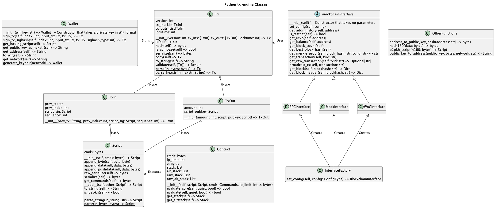
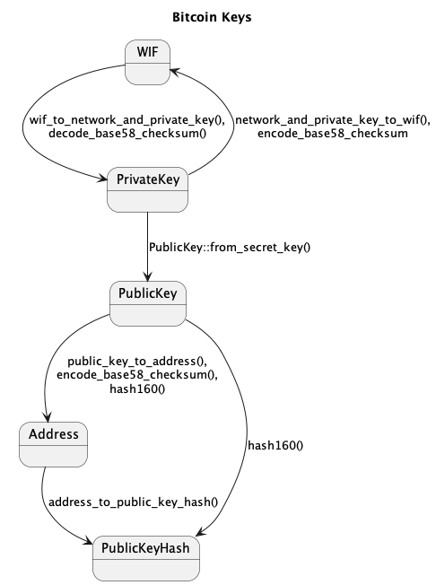

# Python API reference

Class and function reference for **tx-engine**. For install and a quick start, see [README-pypi.md](../README-pypi.md) (PyPI) or [README.md](../README.md) (GitHub). Chronicle examples: [Chronicle-Python.md](Chronicle-Python.md).

## Overview



* [Script](#script)
* [Stack](#stack)
* [Context](#context)
* [Tx](#tx)
* [TxIn](#txin)
* [TxOut](#txout)
* [Wallet](#wallet)
* [HdWallet](#hdwallet)
* [Interface Factory](#interface-factory)
* [Blockchain Interface](#blockchain-interface)
* [Other Functions](#other-functions)

## Script

The Script class represents bitcoin script.
For more details about bitcoin script see https://wiki.bitcoinsv.io/index.php/Script.

Script has the following property:
* `cmds` - byte arrary of bitcoin operations

Script has the following methods:

* `__init__(self, cmds: bytes=[]) -> Script` - Constructor that takes an array of bytes 
* `append_byte(self, byte: byte)` - Appends a single opcode or data byte
* `append_data(self, data: bytes)` - Appends data (without OP_PUSHDATA)
* `append_pushdata(self, data: bytes)` - Appends the opcodes and provided data that push it onto the stack
* `raw_serialize(self) -> bytes` - Return the serialised script without the length prepended
* `serialize(self) -> bytes` - Return the serialised script with the length prepended
*  `get_commands(self) -> bytes` - Return a copy of the commands in this script
* `__add__(self, other: Script) -> Script` - Enable script addition e.g. `c_script = a_script + b_script`
* `to_string(self) -> String` - return the script as a string, that can be parsed by `parse_string()`. Note also that you can just print the script (`print(script)`)
* `is_p2pkh(self) -> bool` - returns True if script is a Pay to Public Key Hash script
* `append_integer(self, i64)` - adds an integer to the stack (assumes base 10)
* `append_big_integer(self, arbitrary_sized_integer)` - adds an arbitrary sized integer to the stack (assumes base 10)


Script has the following class methods:
* `Script.parse_string(in_string: str) -> Script` - Converts a string of OP_CODES into a Script
* `Script.parse(in_bytes: bytes) -> Script` - Converts an array of bytes into a Script

## Stack

The 'Stack' python class provides the python user direct access to the Stack structures used by the intepreter

Stack has the following methods:

* `__init__(self, items: List[List[bytes]]) -> Stack` - Constructor that takes a List of List of bytes
* `push_bytes_integer(self, List[bytes])` - push a arbitrary number in bytes onto the stack
* `decode_element(self, index: option<Int>)` - returns the item at stack location index. Assumption is its an arbitrary sized number
* `size(self)` - returns the size of the stack
* `__getitem__(self, index: int)` - allows array subscript syntax e.g. stack[i] 
* `__eq__(&self, other: Stack)` - allows an equality test on Stack objects

## Context

The `Context` class is the environment in which bitcoin scripts are executed. For Chronicle usage (two-phase eval, `OP_VER`, relaxed clean stack), see [Chronicle-Python.md](Chronicle-Python.md#context-and-chronicle-opcodes).

Context has the following properties:
* `cmds` - the commands to execute
* `ip_start` - the byte offset of where to start executing the script from (optional)
* `ip_limit` - the number of commands to execute before stopping (optional)
* `z` - the hash of the transaction
* `tx_version` - optional transaction version for Chronicle opcodes and rules (optional)
* `lock_script` - optional lock script for Chronicle two-phase eval when `tx_version > 1` (optional)
* `stack` - main data stack
* `alt_stack` - seconary stack

Context has the following methods:

* `__init__(self, script: Script, ip_start: int = None, ip_limit: int = None, z: bytes = None, tx_version: int = None, lock_script: Script = None)` - constructor
* `evaluate_core(self, quiet: bool = False) -> bool` - evaluates the script/cmds using the interpreter and returns the stacks (`stack`, `alt_stack`). If `quiet` is true, do not print exceptions
* `evaluate(self, quiet: bool = False) -> bool` - executes the script and decode stack elements to numbers (`stack`, `alt_stack`). Checks `stack` is true on return. If `quiet` is true, do not print exceptions

When `tx_version > 1` and `lock_script` are set, Chronicle **two-phase** unlock/lock evaluation runs. When `tx_version > 1` alone, Chronicle opcodes and relaxed clean-stack rules apply. Block-height activation is not applied in `Context`; use `Tx.validate_at_height()` for that — see [README.md#chronicle-upgrade](../README.md#chronicle-upgrade) and [Chronicle-Python.md](Chronicle-Python.md).

* `get_stack(self) -> Stack` - Return the `stack` as human readable
* `get_altstack(self) -> Stack`-  Return the `alt_stack` as human readable
* `set_ip_start(self, start: int)` - sets the start location for the interpreter
* `set_ip_limit(self, limit: int)` - sets the end location for the interpreter

Example from unit tests using `evaluate_core` and `Context`:
```python
from tx_engine import Context, Script, Stack
from tx_engine.engine.op_codes import OP_PUSHDATA1, OP_4, OP_NUM2BIN

script = Script([OP_PUSHDATA1, 0x01, b"\x85", OP_4, OP_NUM2BIN])
context = Context(script=script)
context.evaluate_core()
assert context.get_stack() == Stack([[0x85, 0x00, 0x00, 0x00]])

# Chronicle two-phase: unlock computes, lock checks
unlock = Script.parse_string("OP_2 OP_3 OP_ADD")
lock = Script.parse_string("OP_5 OP_EQUAL")
assert Context(script=unlock, lock_script=lock, tx_version=2).evaluate()
```

### Quiet Evalutation
 Both `evaluate` and `evaluate_core` have a parameter `quiet`.
 If the `quiet` parameter is set to `True` the `evaluate` function does not print out exceptions when executing code.  This `quiet` parameter is currently only used in unit tests.


## Tx

Tx represents a bitcoin transaction. Chronicle validation (`validate`, `validate_at_height`) is described in [Chronicle-Python.md](Chronicle-Python.md).

Tx has the following properties:
* `version` - unsigned integer
* `tx_ins` - array of `TxIn` classes,
* `tx_outs` - array of `TxOut` classes
* `locktime` - unsigned integer

Tx has the following methods:

* `__init__(version: int, tx_ins: [TxIn], tx_outs: [TxOut], locktime: int=0) -> Tx` - Constructor that takes the fields 
* `id(self) -> str` - Return human-readable hexadecimal of the transaction hash
* `hash(self) -> bytes` - Return transaction hash as bytes
* `is_coinbase(self) -> bool` - Returns true if it is a coinbase transaction
* `serialize(self) -> bytes` - Returns Tx as bytes
* `to_hexstr(self) -> str` - Returns Tx as hex string
* `copy(self) -> Tx` - Returns a copy of the Tx
* `to_string(self) -> String` - return the Tx as a string. Note also that you can just print the tx (`print(tx)`).
* `validate(self, [Tx]) -> Result` - provide the input txs, returns None on success and throws a RuntimeError exception on failure. Note can not validate coinbase or pre-genesis transactions. Chronicle rules apply when `version > 1` (block height ignored).
* `validate_at_height(self, [Tx], block_height: int, network: str) -> Result` - like `validate`, but gates Chronicle rules on the documented activation height for `network` (`BSV_Mainnet`, `BSV_Testnet`, or `BSV_STN`). See [Chronicle-Python.md](Chronicle-Python.md#height-aware-validation).

    
Tx has the following class methods:

* `Tx.parse(in_bytes: bytes) -> Tx`  - Parse bytes to produce Tx
* `Tx.parse_hexstr(in_hexstr: String) -> Tx`  - Parse hex string to produce Tx

So to parse a hex string to Tx:
```Python
from tx_engine import Tx

src_tx = "0100000001c7151ebaf14dbfe922bd90700a7580f6db7d5a1b898ce79cb9ce459e17f12909000000006b4830450221008b001e8d8110804ac66e467cd2452f468cba4a2a1d90d59679fe5075d24e5f5302206eb04e79214c09913fad1e3c0c2498be7f457ed63323ac6f2d9a38d53586a58d41210395deb00349c0ae73412a55bec70a7793fc6860a193d29dd61d73c6271ffcbd4cffffffff0103000000000000001976a91496795fb99fd6c0f214f7a0e96019f642225f52d288ac00000000"

tx = Tx.parse_hexstr(src_tx)
print(tx)

PyTx { version: 1, tx_ins: [PyTxIn { prev_tx: "0929f1179e45ceb99ce78c891b5a7ddbf680750a7090bd22e9bf4df1ba1e15c7", prev_index: 0, sequence: 4294967295, script_sig: [0x48 0x30450221008b001e8d8110804ac66e467cd2452f468cba4a2a1d90d59679fe5075d24e5f5302206eb04e79214c09913fad1e3c0c2498be7f457ed63323ac6f2d9a38d53586a58d41 0x21 0x0395deb00349c0ae73412a55bec70a7793fc6860a193d29dd61d73c6271ffcbd4c] }], tx_outs: [PyTxOut { amount: 3, script_pubkey: [OP_DUP OP_HASH160 0x14 0x96795fb99fd6c0f214f7a0e96019f642225f52d2 OP_EQUALVERIFY OP_CHECKSIG] }], locktime: 0 }
```


## TxIn
TxIn represents is a bitcoin transaction input.

TxIn has the following properties:

* `prev_tx` - Transaction Id as hex string
* `prev_index` - unsigned int
* `script_sig` - Script
* `sequence` -  int

TxIn has the following constructor method:
* `__init__(prev_tx: String, prev_index: int, script_sig: Script=[], sequence: int=0xFFFFFFFF) -> TxIn` - Constructor that takes the fields 

Note txin can be printed using the standard print, for example: 
```Python
print(txin)
PyTxIn { prev_tx: "5c866b70189008586a4951d144df93dcca4d3a1b701e3786566f819450eca9ba", prev_index: 0, sequence: 4294967295, script_sig: [] }
```


## TxOut
TxOut represents a bitcoin transaction output.

TxOut has the following properties:

* `amount` - int
* `script_pubkey` - Script


TxOut has the following constructor method:

* `__init__(amount: int, script_pubkey: Script) -> TxOut` - Constructor that takes the fields 

Note txin can be printed using the standard print, for example: 
```Python
print(txout)
PyTxOut { amount: 100, script_pubkey: [OP_DUP OP_HASH160 0x14 0x10375cfe32b917cd24ca1038f824cd00f7391859 OP_EQUALVERIFY OP_CHECKSIG] }
```

## Wallet
This class represents the Wallet functionality, including handling of private and public keys and signing transactions.

Wallet class has the following methods:

* `__init__(wif_key: str) -> Wallet` - Constructor that takes a private key in WIF format
* `sign_tx(self, index: int, input_tx: Tx, tx: Tx) -> Tx` - Sign with default `SIGHASH.ALL_FORKID` (low-S). Returns new signed tx
* `sign_tx_sighash(self, index: int, input_tx: Tx, tx: Tx, sighash_type: int) -> Tx` - Sign with explicit sighash flags. Use `SIGHASH.ALL_FORKID_CHRONICLE` for Chronicle (OTDA) spends — see [Chronicle-Python.md](Chronicle-Python.md#signing-with-otda-chronicle-sighash)
* `sign_tx_sighash_flags_checksig_index(self, index: int, input_tx: Tx, tx: Tx, sighash_type: int, checksig_index: int) -> Tx` - as `sign_tx_sighash` with checksig_index
* `get_locking_script(self) -> Script` - Returns a locking script based on the public key
* `get_public_key_as_hexstr(self) -> String` - Return the public key as a hex string
* `get_address(self) -> String` - Return the address based on the public key
* `to_wif(self) -> String` - Return the private key in WIF format
* `get_network(self) -> String` - Returns the current network associated with this keypair
* `to_int(self) -> Integer` - Returns the scaler value of the private key as a python integer
* `to_hex(self) -> String` - Returns the scaler value of the private key as a string in hex format

* `Wallet.generate_keypair(network) -> Wallet` - Given network (BSV_Testnet) return a keypair in Wallet format
* `Wallet.from_hexstr(network, hexstr) -> Wallet` - Given a network identifier and scalar value as a hex string, return a keypair in Wallet format
* `Wallet.from_bytes(network, bytes) -> Wallet` - Given a network identifier and a scalar value as a byte array, return a keypair in Wallet format
* `Wallet.from_int(network, integer) -> Wallet` - Given a network identifier and a scaler value as an integer, return a keypair in Wallet format

The library provides some additional helper functions to handle keys in different formats. 
* `wif_to_bytes(wif: string) -> bytes` - Given a key in WIF format, it returns a byte array of the scalar value of the private key
* `bytes_to_wif(key_bytes, network) -> String` - Given a byte array and a network identifier, returns the WIF format for the private key
* `wif_from_pw_nonce(password, nonce, optional<network>) -> WIF` - Given a password, nonce (strings) return a WIF format for the private key. The default for the network is BSV_Mainnet. For a testnet format, please use BSv_Testnet
* `create_wallet_from_pem_file -> Wallet` - Given a path to PEM format file, return a keypair in Wallet format
* `create_pem_from_wallet -> String` - Given a Wallet, returns a PEM (pkcs8) formatted string of the private key





## HdWallet

BIP-32 hierarchical deterministic wallet. Derive child keys along a path, obtain P2PKH addresses (BIP-44 style), and get a leaf [`Wallet`](#wallet) for signing. Stacks on BIP-39 mnemonic support (`mnemonic_to_seed`).

`HdWallet` class methods:

* `HdWallet.from_seed(network: str, seed: bytes) -> HdWallet` - Master key from a 64-byte BIP-39 seed
* `HdWallet.from_mnemonic(network: str, mnemonic: str, passphrase: str = "") -> HdWallet` - English BIP-39 mnemonic (validated) then seed derivation
* `HdWallet.from_xprv(xprv: str) -> HdWallet` - Root from an encoded extended private key (`xprv...`)

`HdWallet` methods:

* `master_xprv() -> str` - Encoded master extended private key
* `master_xpub() -> str` - Encoded master extended public key
* `address_at(account: int, external: bool, index: int) -> str` - P2PKH address at `m/{account}'/{change}/{index}` (`external=True` → change 0)
* `address_at_bip44(coin_type: int, account: int, external: bool, index: int) -> str` - P2PKH address at a full BIP-44 path
* `wallet_at_path(path: str) -> Wallet` - Leaf signing wallet at the given path (e.g. `m/0'/0/0`)
* `derive_xprv(path: str) -> str` - Extended private key at `path`
* `derive_xpub(path: str) -> str` - Extended public key at `path`

Path helpers (module functions):

* `bip32_path(account: int, change: int, index: int) -> str` - `m/{account}'/{change}/{index}`
* `bip44_path(coin_type: int, account: int, external: bool, index: int) -> str` - `m/44'/{coin_type}'/{account}'/{change}/{index}`
* `bsv_coin_type() -> int` - BSV SLIP-44 coin type (`236`)
* `mnemonic_to_seed(mnemonic: str, passphrase: str) -> bytes` - 64-byte BIP-39 seed (does not validate words)
* `derive_extended_key(xprv: str, path: str) -> str` - Derive extended private key from master `xprv` and path

Example:

```Python
from tx_engine import HdWallet, bip44_path, bsv_coin_type, mnemonic_to_seed

mnemonic = "abandon abandon abandon abandon abandon abandon abandon abandon abandon abandon abandon about"
hd = HdWallet.from_mnemonic("BSV_Mainnet", mnemonic)
addr = hd.address_at_bip44(bsv_coin_type(), 0, True, 0)
wallet = hd.wallet_at_path(bip44_path(bsv_coin_type(), 0, True, 0))
signed_tx = wallet.sign_tx(0, prev_tx, tx)
```


## Interface Factory
The InterfaceFactory is class for creating interfaces to the BSV blockchain (`BlockchainInterface`).

The InterfaceFactory class one method:

* `set_config(self, config: ConfigType) -> BlockchainInterface` - This reads the configuration `interface_type` field and returns the configured `BlockchainInterface`

## Blockchain Interface

The BlockchainInterface class provides an interface to the BSV network.

BlockchainInterface class has the following methods:

* `__init__(self)` - Constructor that takes no parameters
* `set_config(self, config)` - configures the interface based on the provide config
* `get_addr_history(self, address)` - Return the transaction history with this address
* `is_testnet(self) -> bool` - Return true if this interface is connected to BSV Testnet
* `get_utxo(self, address)` - Return the utxo associated with this address
* `get_balance(self, address)` - Return the balance associated with this address
* `get_block_count(self)` - Return the height of the chain
* `get_best_block_hash(self)` - Return the hash of the latest block
* `get_merkle_proof(self, block_hash: str, tx_id: str) -> str` - Given the block hash and tx_id return the merkle proof
* `get_transaction(self, txid: str)` - Return the transaction (as Dictionary) associated with this txid
* `get_raw_transaction(self, txid: str) -> Optional[str]` - Return the transaction (as kexstring) associated with this txid, use cached copy if available.
* `broadcast_tx(self, transaction: str)` - broadcast this tx to the network
* `get_block(self, blockhash: str) -> Dict` - Return the block given the block hash
* `get_block_header(self, blockhash: str) -> Dict` - Returns te block_header for a given block hash

### WoC Interface
The `WoCInterface` is a `BlockchainInterface` that communicates with the WhatsOnChain API. 
Note that if you are using this you will need to install the python library `requests`.

### Mock Interface 
The `Mock Interface` is a `BlockchainInterface` that is used for unit testing.

### RPC Interface 
The `RPC Interface` is a `BlockchainInterface` that is used for connecting to the RPC interface of mining nodes.


### SIGHASH Functions

* `sig_hash(tx: Tx, index: int, script_pubkey: Script, satoshi: int, sighash_flags: int)` - Return the transaction digest/hash
* `sig_hash_preimage(tx: Tx, index: int, script_pubkey: Script, satoshi: int, sighash_flags: int)` - Return the transaction data prior to the hash function

For multiple OP_CHECKSIG in script:
* `sig_hash_checksig_index(tx: Tx, index: int, script_pubkey: Script, checksig_index:int, satoshi: int, sighash_flags: int)` - Return the transaction digest/hash
* `sig_hash_preimage_checksig_index(tx: Tx, index: int, script_pubkey: Script, checksig_index: int, satoshi: int, sighash_flags: int)` - Return the transaction data prior to the hash function


Given:
  * `tx` - Spending transaction
  * `index` - Spending input index
  * `script_pubkey` - The lock_script of the output being spent
  * `checksig_index` - The index of the OP_CHECKSIG to be used for the hash (if more than one)
  * `satoshis` - The satoshi amount in the output being spent
  * `sighash_flags` - Sighash flags

Note the sighash flags can be obtained from the `SIGHASH` class which supports the following flags:
``` 
    ALL
    NONE
    SINGLE
    ANYONECANPAY
    FORKID
    ALL_FORKID = ALL | FORKID
    NONE_FORKID = NONE | FORKID
    SINGLE_FORKID = SINGLE | FORKID
    ALL_ANYONECANPAY_FORKID = ALL_FORKID | ANYONECANPAY
    NONE_ANYONECANPAY_FORKID = NONE_FORKID | ANYONECANPAY
    SINGLE_ANYONECANPAY_FORKID = SINGLE_FORKID | ANYONECANPAY
```
For further details see https://wiki.bitcoinsv.io/index.php/SIGHASH_flags

Example usage:
```Python
sig_hash_value = sig_hash(own_tx, 0, script_pubkey, 99904, SIGHASH.ALL_FORKID)
```


## Other Functions
These are public key and address functions that are likely to be used if you don't have the private key and 
are not using the Wallet class.

* `address_to_public_key_hash(address: str) -> bytes` - Given the address return the hash160 of the public key
* `hash160(data: bytes) -> bytes` - Returns the hash160 of the provided data (usually the public key)
* `p2pkh_script(h160: bytes) -> Script` - Takes the hash160 of the public key and returns the locking script
* `public_key_to_address(public_key: bytes, network: str) -> String` - Given the public key and the network (either `BSV_Mainnet` or `BSV_Testnet`) return the address
